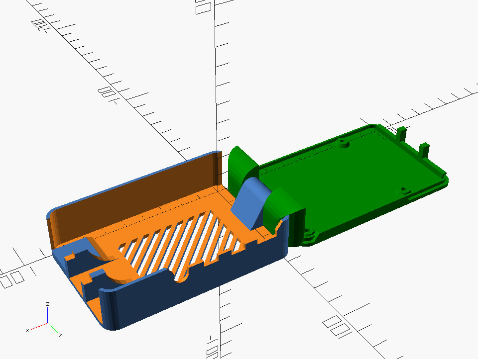

Print-in-place enclosure for a Raspberry Pi 4.  There are existing cases but I figured I'd eliminate some screws and bring the overall size down a bit.  Early prototypes are promising but the clearances need work.  

With the parameterization I'm hoping to be able to accommodate fans and various options for the ribbon cables and GPIO stuff.

 

10/14/2021 - Version 1.0 is ready.  Tweaked clearances and cleaned up the port openings.  Going to add some ventilation options, but I'm going to step away from this for just a bit.

